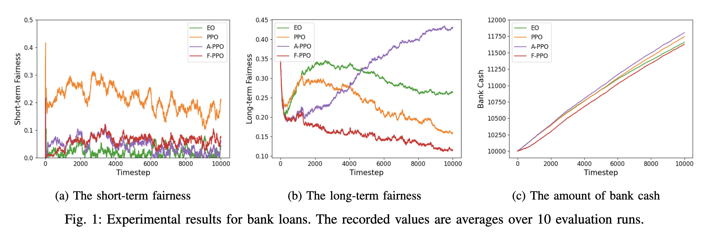
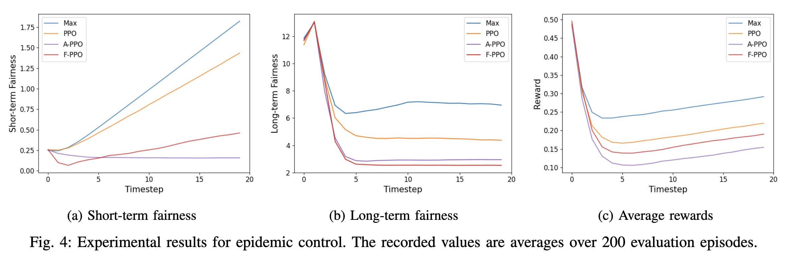

# Fairness in Reinforcement Learning

This repo contains the source code of paper "Achieving Long-term Fairness in Sequential
Decision-Making Through Reinforcement Learning".


## Quickstart

1. Install the dependency packages.
```
pip install requirements
```

2. Run the case studies.
``` 
cd lending / infectious
python main.py
```

## Results

1. Case Study: Bank Loans
The codes for this case study is in the folder "lending". 
To run different algorithms, change variable MODEL in config.py.




2. Case Study: Epidemic Control
The codes for this case study is in the folder "infectious". 
To run different algorithms, change variable MODEL in config.py.




